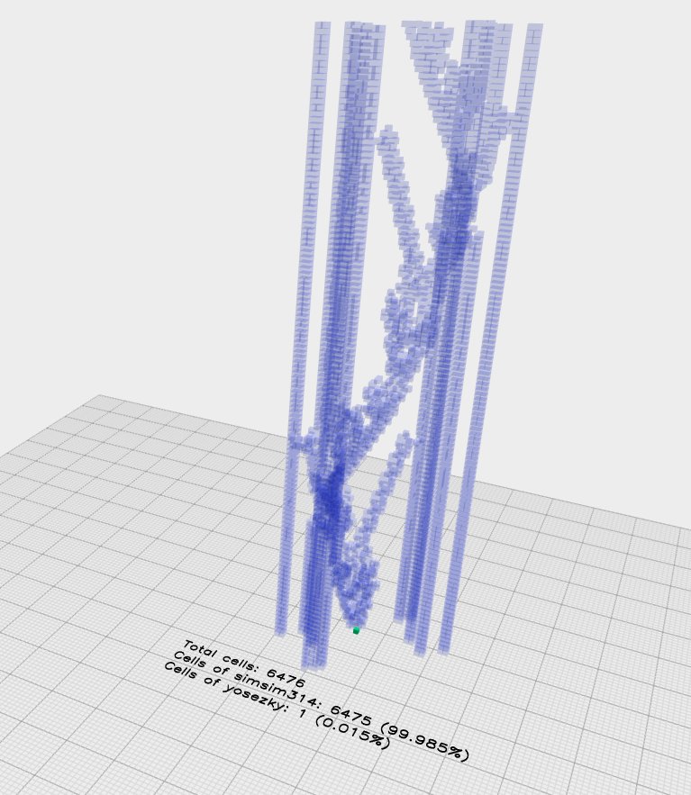

# Crypto art sale to back frictionless market
A visual art based on Conway's game of life being sold as crypto commodity, by creator of the art piece.

Hello my name is Michael Simkin and I've written the search tool and discovered the [P120 Simkin Gun](http://www.conwaylife.com/wiki/Simkin_glider_gun). In this project I want to promote the art sale of this discovery based on crypto technology (in order to promote cellular automata as well as blockchain technologies research). Please read the white paper for wider perspective.

Backed by this art piece I also provide a frictionless market where you only pay the gas for your transactions, using currencies backed by cubes you buy inside the art piece. Special tools are provided to change and modify the visual effects of the 3D cubes you buy. 

Also follow the [youtube chanel](https://www.youtube.com/channel/UCPW4R4oxAJ16zasfncp2f7A) for this project. 
